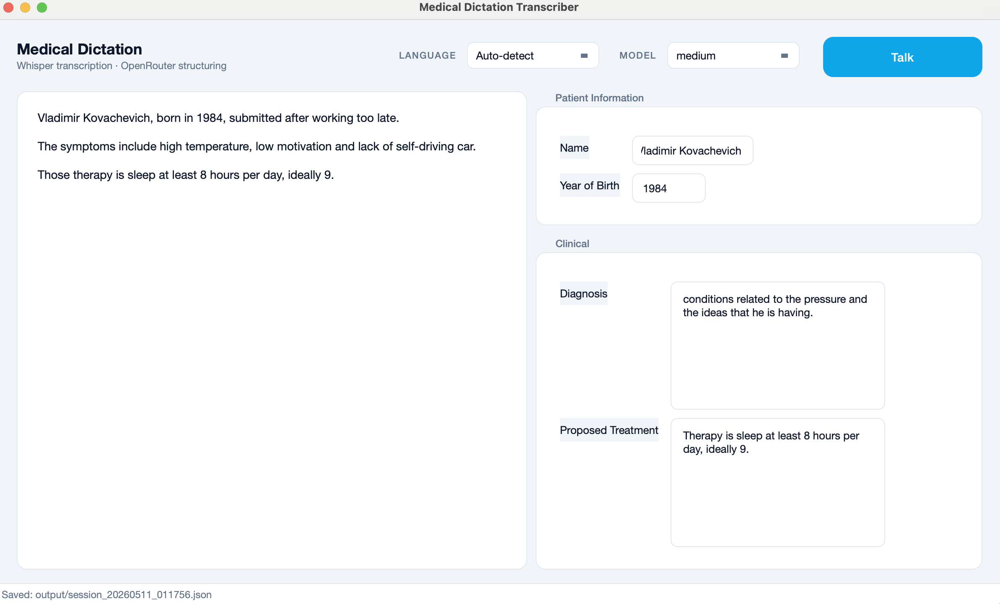

# DictaForm

Real-time medical dictation that fills a structured form while the doctor speaks.



Speak into the mic. The left panel streams the transcript as Whisper finishes each
utterance; the right panel is a config-driven form that a free LLM keeps in sync
with the running transcript. Press **Stop** to save a timestamped JSON of both
the raw transcript and the structured fields.

## Pipeline

```
[Mic] → AudioCapture → VadSegmenter → Whisper → Structurer (OpenRouter) → UI
        sounddevice    webrtcvad      openai-    free-tier LLM            PySide6
                                      whisper    fallback chain
```

Two long-lived `QThread` workers (transcriber, structurer) connected by Qt
signals. Audio frames flow through a bounded `queue.Queue`; only the latest
transcript is ever queued for structuring, so a slow LLM never causes a backlog.

## Setup

Requires Python 3.10+ and an [OpenRouter API key](https://openrouter.ai/keys)
(free tier is fine).

```bash
conda create -n dictaform python=3.11 -y
conda activate dictaform
# macOS x86_64 (Rosetta) needs llvmlite/numba from conda-forge first:
conda install -c conda-forge llvmlite numba -y    # macOS x86_64 only
pip install -r requirements.txt

cp .env.example .env
# edit .env and paste your OpenRouter key
```

## Run

```bash
python main.py
```

First **Talk** press downloads the chosen Whisper model into `~/.cache/whisper/`
(~470 MB for `small`, ~1.5 GB for `medium`, ~3 GB for `large`).

## Configuring the form

The right-hand form is generated entirely from `config.json`. Add a field, get a
widget *and* a prompt update for free:

```json
{
  "groups": [
    {
      "name": "Patient Information",
      "fields": [
        {"key": "patient_name",  "label": "Name",          "type": "string"},
        {"key": "year_of_birth", "label": "Year of Birth", "type": "integer"}
      ]
    },
    {
      "name": "Clinical",
      "fields": [
        {"key": "diagnosis", "label": "Diagnosis",          "type": "text"},
        {"key": "treatment", "label": "Proposed Treatment", "type": "text"}
      ]
    }
  ]
}
```

Field types: `string` (single-line), `text` (multi-line), `integer`.
The same schema drives both the UI and the JSON schema sent to the LLM.

## Hallucination resistance

Whisper happily emits *"Thanks for watching!"* on silence. Three defences
applied in `source/transcriber.py`:

- **Pre-filter** — drop segments shorter than 400 ms or below RMS 0.004.
- **Hardened Whisper thresholds** — stricter `no_speech_threshold`,
  `logprob_threshold`, `compression_ratio_threshold`, and
  `hallucination_silence_threshold` than the library defaults.
- **Post-filter** — a small blacklist of canonical boilerplate
  (*"Thanks for watching"*, *"you"*, *"[Music]"*, …) matched after punctuation
  and case normalisation, so a real *"Thank you for the referral"* is **not**
  dropped.

## Structuring

The structurer tries free OpenRouter models in priority order; any 4xx/5xx, JSON
parse failure, or empty content advances the chain:

1. `openai/gpt-oss-120b:free`
2. `google/gemma-4-31b-it:free`
3. `z-ai/glm-4.5-air:free`

`reasoning.exclude` is passed so reasoning-capable models don't burn the token
budget on hidden thinking. User-edited form fields are sticky against LLM
overwrites via per-field dirty flags.

## Languages

English and Serbian (`sr`), plus auto-detect. Set in the top bar.

## Privacy note

Audio never leaves the machine — Whisper runs locally. **Transcripts do** —
they're sent to OpenRouter for structuring. If the dictation contains PHI,
either route the structurer to a HIPAA-compliant provider or replace it with a
local LLM (the `Structurer` API is thin enough to swap).

## Project layout

```
main.py                 # entry point — loads .env, applies theme, opens window
config.json             # form schema (drives UI and LLM prompt)
requirements.txt
source/
  audio_capture.py      # sounddevice → 16 kHz / 30 ms frames into a queue
  vad_segmenter.py      # webrtcvad → utterance boundaries
  transcriber.py        # openai-whisper wrapper + hallucination filters
  structurer.py         # OpenRouter client + model fallback chain
  workers.py            # TranscriberWorker + StructurerWorker (QThreads)
  transcript_widget.py  # left panel (read-only, append-only)
  form_widget.py        # right panel (built from config, dirty-flag protection)
  session_saver.py      # output/session_YYYYMMDD_HHMMSS.json
  main_window.py        # window, Talk/Stop, signal wiring
  theme.py              # global QSS, palette, repolish helper
  logging_setup.py
  config_loader.py
```
